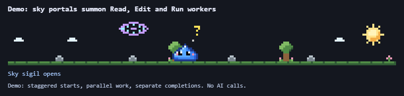
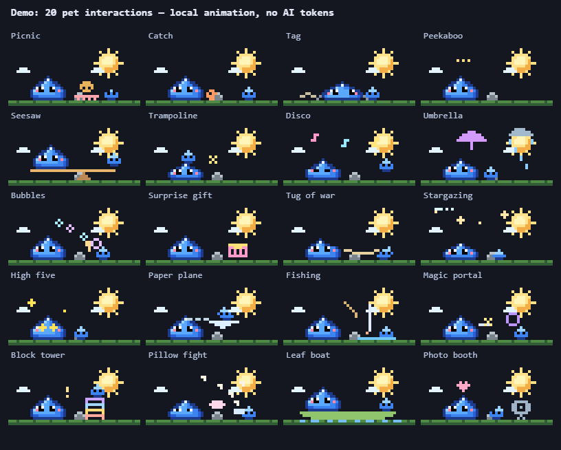
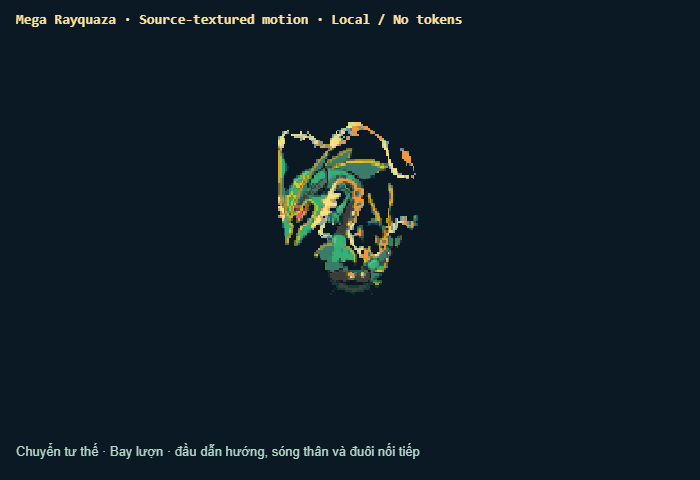
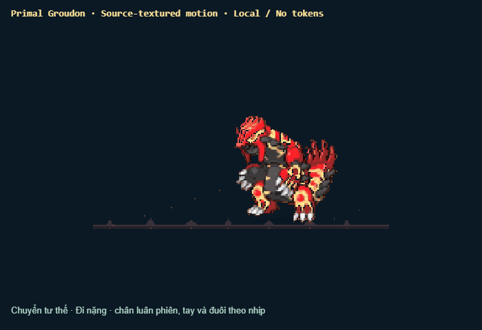
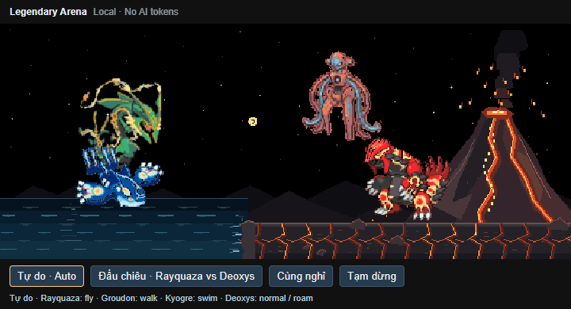

<p align="center">
  
</p>

<h1 align="center">Pixel Familiars</h1>

<p align="center">Animated pixel companions for <strong>Codex</strong> and <strong>Claude Code</strong>.<br>See your AI's activity, context and quota through a living pixel world.</p>

<p align="center">
  <a href="#codex"></a>
  <a href="#claude-code"></a>
  <a href="LICENSE"></a>
</p>

Owned and maintained by **[PhucUSk20](https://github.com/PhucUSk20)**. Based on [Namenomeaning/pixel-pet](https://github.com/Namenomeaning/pixel-pet), with original authorship and MIT notices preserved.

## Choose your companion

Both integrations use the shared pixel engine and theme format. Each connects to its own runtime; features differ where their event streams and display surfaces differ.

| | Codex | Claude Code |
| --- | --- | --- |
| Display | Responsive VS Code panel | Pet above the terminal prompt, HUD below |
| Activity | Native hooks, with a session-log fallback | Claude Code mod events |
| Shared pet motions | Read, search, write, terminal, web, think and celebrate | Read, search, write, terminal, web, think and celebrate |
| HUD | Context remaining and reported quota/reset times | Context remaining and reported quota/reset times |
| Customization | MCP theme tools, preview and import | Plugin skill, preview and theme tools |
| Task companions | Portal workers, subagent minis and automatic project Mini | Subagent minis following the main pet |
| Idle play | Independent roaming and 20 pet interactions | Breathing, looking around and sleep |
| Legendary Pets | Mega Rayquaza, Primal Groudon, Primal Kyogre, Deoxys and shared Arena | Available through the Codex VS Code companion |
| Detailed guide | [Codex guide](docs/CODEX.md) | [Claude Code guide](docs/CLAUDE.md) |

Observation and animation run locally and add **no AI calls or tokens**. Asking an AI to redesign a theme uses its normal chat/tool workflow.

## Get started

Clone this repository to install the Codex companion or load the Claude plugin directly from source:

```bash
git clone https://github.com/PhucUSk20/pixel-familiars.git
cd pixel-familiars
```

### Codex

Requirements: Node **22.18+**, VS Code with the `code` command available, and the Codex extension installed.

Run one installation command from the cloned folder:

```powershell
npm.cmd run install:codex
```

On macOS/Linux, use `npm run install:codex`. The installer downloads dependencies, builds/packages the extension, installs it and configures the local observer hooks and MCP theme tools. It opens the bundled Codex CLI for hook review:

1. Approve folder trust if prompted. Enter `/hooks`, review and trust the 12 **Pixel Pet observer** entries.
2. Exit the review CLI. Run **Developer: Reload Window**, then **Pixel Pet: Open Companion** in VS Code.
3. Start a new Codex conversation and run a tool. The panel should show **Direct hooks** after receiving a real event.

**Direct hooks** provides the fullest tool/subagent timing and compaction animations. **Log fallback** remains available when native events are unavailable; it cannot recover every nested start time. Review is required by Codex and is not granted automatically. The review CLI can close after approval.

<p align="center"></p>

Tools summon worker minis through colored sky portals. Parallel work keeps separate workers until recorded completion. Success brings a parcel back to the main pet; failure brings a clickable error sign. The persistent Mini watches observed checks and editor errors automatically.

The pets also explore independently and occasionally meet for **20 different idle interactions**. Feed invites a picnic, Play starts catch, and Rest pauses autonomous play. Real work interrupts play. The meadow fills the panel width, and short panels move the compact HUD into a corner. Workplace buildings are temporarily disabled.

<p align="center"></p>

The Codex GIFs use simulated activity with the production renderer. Update by rerunning the installer and reviewing changed hook definitions. Read the [Codex guide](docs/CODEX.md) for session selection, quota readings, settings, privacy and panel placement. The pet is a separate view rather than an embedded part of Codex's chat.

### Claude Code

Requirement: Claude Code **2.1.287+** (`claude --version`). Install the plugin from this repository's marketplace:

```bash
claude plugin marketplace add PhucUSk20/pixel-familiars
claude plugin install pixel-pet@pixel-pet
```

Start a new session, or run `/reload-plugins`. The pet appears above the terminal prompt with its context/quota HUD below.

The marketplace and plugin retain their established `pixel-pet` identifiers. If you already use the original marketplace, you can try this checkout for one session without changing that installation:

```bash
claude --plugin-dir ./plugins/pixel-pet
```

<p align="center"></p>

The pet acts out reading, searching, writing, terminal commands and web activity. Subagents get minis that remain until they finish. Tool failures change the pet's expression; completed turns make it cheer. Idle time brings breathing, blinking and sleep.

Run `/plugin configure pixel-pet@pixel-pet` for speed, sleep, HUD, status text and subagent minis. Ask Claude to customize a pet or run `/pixel-pet:pixel-pet`; review its browser preview before applying the theme. See the [Claude Code guide](docs/CLAUDE.md) for settings, updating, supported displays, privacy and development checks.

## Context and quota HUD

- **HP**: context window remaining.
- **MP**: remaining reported 5-hour quota, with a reset countdown.
- **ST**: remaining reported 7-day quota, with a reset countdown.

Quota availability depends on the runtime and account. Missing readings stay unknown. The bars reflect observed usage, not extra permissions or guaranteed task capacity. Low readings change colors and pet expressions.

## Make it yours

Both integrations support custom pixel pets, props, effects, status text, HUD colors and scenes through the shared [theme format](plugins/pixel-pet/skills/pixel-pet/FORMAT.md).

Try a purple slime, a rubber duck, a moon scene, a radar for web searches or a HUD named FUEL. **Codex** uses `get_theme`, `get_theme_format`, `preview_theme` and `set_theme`; **Claude Code** uses its plugin skill and theme tools. Preview the result before applying it.

<p align="center"></p>

## Legendary Pet

In VS Code, run **Pixel Pet: Open Legendary Pet** for an independent panel. Mega Rayquaza has five actions: **flight, curled sleep, roar, Dragon Pulse and dash/braking**, with smooth transitions, Auto and Pause. **Hình gốc** plays the unchanged source frames for comparison.

<p align="center"></p>

Its animation runs locally, shares no AI session and makes no model requests.

Run **Pixel Pet: Open Primal Groudon** for a separate volcanic pixel stage. Its six actions are **heavy walking, sleep, roar, Precipice Blades, Energy Burst and Eruption**. Arms, legs, head, jaw and tail follow their own motion, with smooth interrupted transitions. Precipice Blades raises molten rock blades from the ground; Energy Burst charges a purple orb at the mouth before launching it with recoil; Eruption launches fireballs diagonally from the mouth before they fall as a meteor shower.

<p align="center"></p>

The supplied 128px artwork and all 160 original frames are preserved. **Hình gốc**, Auto and Pause are available. The purple attack uses a descriptive name from the reference GIF rather than assuming its canonical move name. All Groudon animation is local and adds no AI calls or tokens. [Groudon design and controls](docs/PRIMAL-GROUDON.md).

## Develop

- **Shared engine and Claude adapter:** `plugins/pixel-pet/`.
- **Codex adapter and VS Code panels:** `extensions/codex/`.
- **Build, packaging and recordings:** `tools/codex/`.
- **Independent repo workflow and upstream contributions:** [development guide](docs/DEVELOPMENT.md).

For the Codex companion, run `npm.cmd ci`, `npm.cmd run typecheck`, `npm.cmd test` and `npm.cmd run package`. Also run `npm.cmd run test:ui` after host, renderer or bridge changes. On macOS/Linux, use `npm`.

For Claude plugin changes, follow [CLAUDE.md](CLAUDE.md) and run:

```bash
claude plugin validate . --strict
claude plugin validate plugins/pixel-pet --strict
claude plugin test plugins/pixel-pet
```

The [Claude Code guide](docs/CLAUDE.md#develop) includes generated-type setup and preview checks. Recreate Codex GIFs with `npm.cmd run record:codex-pets` or `npm.cmd run record:legendary` (Chrome/Edge and ffmpeg required).

## Privacy and security

The **Codex companion** observes local hooks, workspace-scoped session logs and project diagnostics. It retains sanitized activity metadata, not prompts, reasoning or full tool output. It does not modify OpenAI's installed extension or approve tools.

The **Claude plugin** runs inside Claude Code, reads its theme/session usage/subagent state and draws the pet. The mod makes no network requests, starts no processes and reads no environment variables. Its optional status targets show short file/command hints; turn those off when sharing your screen.

See each integration's guide for details. Report vulnerabilities through a [private security advisory](https://github.com/PhucUSk20/pixel-familiars/security/advisories/new).

## Primal Kyogre

Run **Pixel Familiars: Open Primal Kyogre** for seven source-textured actions: swimming, diving, resting, roaring, five-orb rays, a curled wave and a rainstorm. Fins, tail, head and jaw articulate independently with smooth transitions. **Sprite gốc** preserves the 160-frame source loop; Auto and Pause are available. Kyogre also lives in the sea of Legendary Arena and automatically spars with Groudon, alternating with Rayquaza. Everything runs locally with no AI calls or tokens. [Design and controls](docs/PRIMAL-KYOGRE.md).


## Rayquaza vs Deoxys

Arena's **Đấu chiêu · Rayquaza vs Deoxys** mode stages a local aerial match: Dragon Pulse meets Defense's reflective barrier, Attack launches Psycho Boost while Rayquaza dives aside, Speed zigzags through an aerial chase, and Normal's psychic pulse clashes with Rayquaza's beam. Kyogre and Groudon simultaneously cycle five turns of five horizontal water jets, energy burst, rock blades, meteor rain and a water/fire beam clash below, with an independent timer that continues during aerial transformations. Both aerial pets fly into position; Deoxys changes forms through falling-meteorite contact between rounds. Pause, Rest and Auto can interrupt the choreography.


## Deoxys · four forms and a meteorite

Deoxys flies freely; a meteorite falls nearby, then Deoxys descends, touches it and transforms into randomly ordered Attack, Defense and Speed forms. Each has its own articulated skill animation; all four can be viewed in the Deoxys panel and Deoxys also lives in Legendary Arena. Runs locally without AI token usage.


Open **Pixel Familiars: Open Deoxys**. [Controls and animation details](docs/DEOXYS.md).

## License and attribution

[MIT](LICENSE). Pixel Familiars is maintained by **[PhucUSk20](https://github.com/PhucUSk20)**. Original Pixel Pet by **halluqinate**, from [Namenomeaning/pixel-pet](https://github.com/Namenomeaning/pixel-pet). Original copyright notices and commit authorship are preserved.

### Shared Legendary Arena

Version 0.16.1 expands the arena to the panel width without enlarging the pets or stretching the volcano. Groudon walks only on the basalt land; Rayquaza can fly across the sky and change altitude. Resizing keeps both pets inside their movement bounds.

Open **Pixel Familiars: Open Legendary Arena** after reloading VS Code. **Tự do · Auto** is the default: each pet roams and chooses activities independently, occasionally meets the other for a short sparring session, then returns to roaming. No tasks or clicks are required. **Đấu chiêu** keeps them sparring; **Cùng nghỉ** lets all four rest. Sparring cycles Dragon Pulse, Energy Burst, Precipice Blades and Eruption with charging, projectiles, shields and recovery. The arena has a black starry sky, a rippling ocean on the left, a flat basalt coast and an erupting volcano behind Groudon. All four pets retain their articulated source sprites. Kyogre swims only within the sea and alternates sparring turns with Rayquaza. Pause freezes pets and scenery. Everything runs locally with no AI requests or tokens; individual pet panels remain available.


