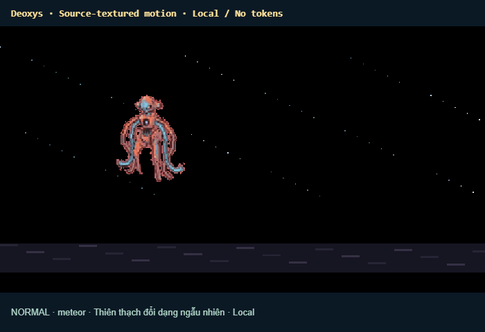
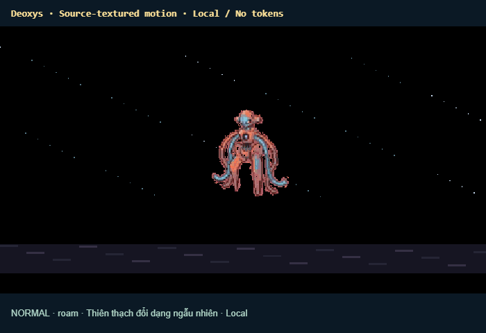
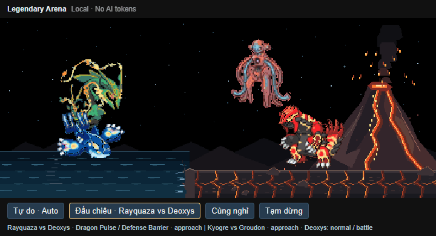

# Deoxys · Meteorite Sanctuary

Open **Pixel Familiars: Open Deoxys** for a dedicated panel, or **Pixel Familiars: Open Legendary Arena** to share the scene with Rayquaza, Groudon and Kyogre.

In the shared Arena, Deoxys uses a higher flight lane over the coast to give the other pets space. It descends only for meteorite contact.

Everything runs locally: Canvas animation and a bounded simulation clock. No model calls, prompts, API keys or AI token usage. Hidden panels and Pause stop the simulation.

## Autonomous life

Deoxys flies across the sky and changes altitude. A meteorite descends diagonally from above, leaves a glowing trail and lands beside its current position with dust and a shock ring. Only after landing does Deoxys fly over, lower itself, extend its arm and transform through psychic rings and a silhouette flash. The meteorite dissolves when the transformation finishes. Normal becomes Attack, Defense or Speed. A shuffled random bag visits all three variants before repeating. Each variant performs its skill, returns to the meteorite and restores Normal. Normal also demonstrates its own skill before the next cycle.

| Form | Motion and effects |
| --- | --- |
| Normal | Levitating limbs, psychic charge, orbiting motes and a pulse projectile |
| Attack | Extended tentacles, three energy orbits, large Psycho Boost sphere and recoil |
| Defense | Braced stance, layered barrier, hexagonal nodes and reflected sparks |
| Speed | Opposed arm/leg motion, rapid lateral dodges, translucent afterimages and speed streaks |

Buttons trigger meteorite contact or the current skill. Rest holds the current form. Auto resumes autonomous activity. Original plays the current form's supplied 160-frame GIF atlas. Transformation is visual choreography, not an AI task or a new agent.

## Art and references

All four supplied 128px GIFs remain unchanged. Atlases remove the flat background; articulated meshes sample the source palette with continuous shoulder/hip attachments. Floating, contact and attack transitions interpolate poses. These are newly designed pixel choreographies, not exact copies of anime frames.

The [Attack clip](https://i.pinimg.com/originals/7d/67/bd/7d67bde2dda65132a1dff90695bc5064.gif) inspired the extending tentacles and orbiting energy sphere. The [Tenor reference](https://tenor.com/view/deoxys-pok%C3%A9mon-deoxys-defence-deoxys-gif-26156782) is tagged Defense, despite being supplied for Normal. The [Reddit reference](https://www.reddit.com/r/TopCharacterTropes/comments/1twrep5/shapeshifter_has_a_rounder_defense_form/) illustrates the rounded defense silhouette; the barrier choreography is our design. The supplied [Smogon page](https://www.smogon.com/forums/threads/deoxys-speed.3632208/) returned HTTP 403 during research; Speed choreography is based on the supplied sprite rather than claiming to reproduce an unseen clip.

Recreate the production GIF with `npm run build` then `npm run record:deoxys`. Use `node tools/codex/record-deoxys.mjs --check` to include browser validation.

## Rayquaza duel (0.19.0)

In Arena, select **Đấu chiêu · Rayquaza vs Deoxys**. Rayquaza and Deoxys fly into opposing positions. Four rounds cycle: Defense reflects Dragon Pulse, Attack fires Psycho Boost while Rayquaza dodges below the trajectory, Speed creates afterimages during pursuit, and Normal engages in a two-beam clash. Required forms are selected for this choreography, but changes still occur only after a meteorite falls and Deoxys touches it. Kyogre and Groudon fight simultaneously below, using an independent five-turn cycle that continues during meteorite interludes. Auto resumes autonomous life; Rest and Pause remain available.

The [energy-sphere reference](https://giffiles.alphacoders.com/916/91620.gif) inspired extending tentacles, orbital charge and the projectile. The [second clip](https://i.makeagif.com/media/2-02-2015/O1KloF.gif) inspired the mouth charge and large discharge. The supplied [Tumblr page](https://jadeazora.tumblr.com/post/651476068678680576/i-always-just-really-loved-this-fight-and-doing) could not be fetched for visual inspection. Pixel choreography uses the supplied sprites and is not a frame-for-frame recreation.

Record this production sequence with `npm run record:arena`; add `-- --check` for browser checks. `npm run record:arena -- --auto` records autonomous life separately.

### Shape and targeting correction (0.19.2)

Transformation uses relaxed joints and a stable torso while swapping the original forms under the flash. Skin weights keep the chest rigid and limit tentacle stretch. Arena projectiles target Rayquaza's current articulated head in Auto and Duel, snapshotting both origin and target at release; the trail and overshoot follow that same line. Rayquaza can subsequently dodge; projectiles do not home after launch. The standalone preview retains its free demonstration direction.
