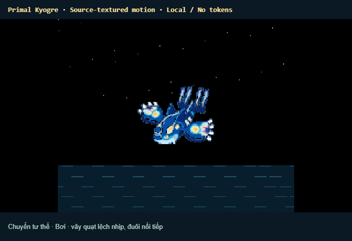

# Primal Kyogre · 0.17.0

Open **Pixel Familiars: Open Primal Kyogre** after reloading VS Code. The dedicated panel has **Hình gốc**, **Auto**, seven manual actions and **Tạm dừng**. The shared **Legendary Arena** also includes Kyogre by default: it swims in the sea, chooses local activities, joins short battles against Groudon and returns to swimming. Rayquaza and Kyogre alternate as Groudon's sparring partner. Manual arena Duel cycles both pairs; Rest pauses travel for all four while breathing continues.

| Action | Motion and effects |
| --- | --- |
| Bơi | Fins beat with a phase lag; head, body roll and tail follow the swimming rhythm. |
| Lặn | Head tilts down, fins sweep back, body sinks and fades under water; bubbles rise before resurfacing. |
| Nghỉ | Fins settle, eyes close and breathing continues. |
| Gầm | Head lifts, lower jaw opens, fins spread and sound rings expand. |
| Cầu sáng / tia nước | Five blue orbs gather near the articulated mouth, then release five parallel horizontal water jets from the mouth with recoil. |
| Sóng lớn | Body rises and summons two tall spiraling waterspouts; the funnels converge, form a rotating water drill and burst against the target with spray and steam. |
| Mưa giông | Fins spread, clouds gather, rain falls and intermittent lightning strikes the water. |

These are local visual actions inspired by the supplied clips; the descriptive water-attack names do not assert which canonical move every clip depicts. No model requests, API key or AI tokens are used. Switching actions blends from the current pose, including interrupted transitions. Hidden views stop advancing time; pause freezes both sprite and effects. Toolbar and canvas reflow with the panel size.

The user's `extensions/codex/kyogre-primal-128px.gif` remains unchanged. All 160 frames are retained in a transparent atlas; the original-frame playback reconstructs the source exactly over its original background. Animated actions use its source pixels with separate head, jaw, near/far fin and tail articulation, not substitute artwork.

Recreate with `npm run record:kyogre -- --check` (Chromium and ffmpeg required). Use `-- --action pulse`, `-- --action wave`, or `-- --original` for isolated previews. Tests cover pose continuity, source colour fidelity, all source frames, seven distinct actions, attack phases, pause, resize, local execution and ocean-bounded automatic life.

Visual references supplied by the user: [orb charge](https://i.pinimg.com/originals/c5/6f/a1/c56fa1a94f477a6cec54100c929e6f6d.gif), [storm flight](https://i.pinimg.com/originals/47/ff/83/47ff83603be8821b57b8a1a6e342e9b0.gif), [multiple rays](https://i.pinimg.com/originals/dc/cc/f3/dcccf35adf94ec6a82831e42211a063d.gif), [encounter](https://www.tumblr.com/toasty-coconut/96592695985/encounter-with-primal-groudon-and-kyogre), [surfacing](https://c.tenor.com/t_qTaxurBbYAAAAC/primal-kyogre.gif). Reference downloads stay in ignored `dist` and are not packaged.

In 0.19.3, released water cannon jets form a five jets from the five circularly arranged charging orbs starting at the articulated mouth. Arena adds a fifth ground-pair round: water and fire beams collide between Kyogre and Groudon, followed by a shockwave.

Arena storm: clouds and rainfall stretch from Kyogre across Groudon. Lightning descends from overhead and targets Groudon's armor, with impact sparks and a brief local hit reaction. The standalone Kyogre panel retains its demonstration strike target.
